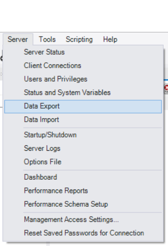
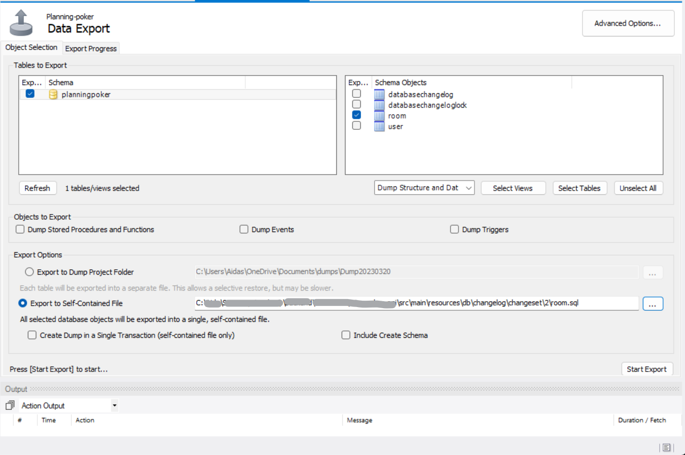

## Backend application setup

### Required tools

### HomeBrew (MacOS only)

- bash command: '/bin/bash -c "$(curl -fsSL https://raw.githubusercontent.com/Homebrew/install/HEAD/install.sh)"'

#### Java

- Java 17 (Windows)
  - Java 17 JDK download: [https://adoptium.net/](https://adoptium.net/)
  - Environment variables needed (Windows)
    - “JAVA_HOME” - https://confluence.atlassian.com/doc/setting-the-java_home-variable-in-windows-8895.html
    - "Path" – add path to your JDK bin file (e.g. C:\Program Files\Eclipse Adoptium\jdk-17.0.4.101-hotspot\bin)
- Java 17 (MacOS)
  - JAVA 17 JDK download: console command: "brew install --cask temurin"
  - Environment variables applying
    - e.g. export JAVA_HOME=`/usr/libexec/java_home -v 17`
- PC restart might be needed for environment variables to be applied

#### Gradle

- Gradle
  - [https://gradle.org/install/](https://gradle.org/install/)
  - Environment variables needed (Windows)
    - "Path" (e.g. C:\Gradle\gradle-7.3.3\bin)
- PC restart might be needed for environment variables to be applied

#### Liquibase

- Liquibase
  - [https://www.liquibase.com/download](https://www.liquibase.com/download)
  - Environment variables needed (Windows)
    - "Path" (e.g. C:\Program Files\liquibase)
- PC restart might be needed for environment variables to be applied

#### Database migration using Liquibase

If you want to update the database and include it in liquibase changelog, you need to do the following: <br />

- Create new folder in: /src/main/resources/db/changelog/changeset and name it according to the following number of the name of folders you will find at this path
- Open mysql workbench and select data export

  
  <br /><br />

- **Important!** **Only** select tables you created or modified, select 'Export to Self-Contained File, name the file according to table name, select 'Dump Structure and Data' and click 'Start Export' button. If you have multiple tables modified, best practice would be to generate separate .sql exports

  
  <br /><br />

- In the folder you have created earlier and exported this .sql file, create .xml file with proper naming like < date >\_< summing up changes you made >.xml for example: **2023.03.20_create_room_entity.xml**

- Make sure the exported .sql file and changeset .xml are in the same folder you created at the very beginning

- In .xml file include this boilerplate code <br />

```
<?xml version="1.0" encoding="UTF-8"?>
<databaseChangeLog
  xmlns="http://www.liquibase.org/xml/ns/dbchangelog"
  xmlns:xsi="http://www.w3.org/2001/XMLSchema-instance"
  xsi:schemaLocation="http://www.liquibase.org/xml/ns/dbchangelog
      http://www.liquibase.org/xml/ns/dbchangelog/dbchangelog-4.1.xsd">
  <changeSet id="<your desired id>" author="<Your name, surname>">
    <sqlFile path="./db/changelog/changeset/<change set folder you created>/<.sql file you dumped>"/>
  </changeSet>
</databaseChangeLog>
```

- Edit boiler plate code according to your .sql file path, your credentials and change the change set id to your desired name.

- Finally, go to file located in /src/main/resources/db/changelog/liquibase-changelog.xml and add new include element after last include element like this:

```
    <include
      file="changeset/2/2023.03.20_create_room_entity.xml"
      relativeToChangelogFile="true"/>
```

- Run spring boot application to ensure there are no errors

#### Docker

- Docker
  - [https://www.docker.com/](https://www.docker.com/)

#### IDE

- Recommended IDE – Intellij Community version (If there is posibility Ultimate version would be even better)
  - https://www.jetbrains.com/idea/download/#section=windows
  - Nothing wrong if Eclipse or Visual Studio code will be used

### Installing MySql and setting up the connection

- go to https://dev.mysql.com/downloads/workbench/ and download the latest mySQL installer.
- when installing, choose **Developer Default** setup type.
- In Accounts and Roles tab set a password and **remember it**.
- After successful instalation, open command prompt and type:<br /> mysql -u \<yourUsername(Default: root)\> -p \<your password that you had to remember\>

- Create new user ace by typing: <br />CREATE USER '\<user you have in slack\>'@'localhost' IDENTIFIED BY '\<password you have in slack\>';

- Grant permisions to \<user you have in slack\> user:<br />
  GRANT ALL PRIVILEGES ON _._ TO '\<user you have in slack\>'@'localhost' IDENTIFIED BY '\<password you have in slack\>';

- Create new database by typing<br />
  CREATE DATABASE **planningpoker**;

- Try to run backend project in IntelliJ by running PlanningPokerApplication.
  See if api returns empty array by typing in browser:<br />
  http://localhost:8081/api/v1/users/allUsers

- If you get [], it means that whole setup was successful.

### Setting up database and docker to use it

#### Starting required docker containers

- go to "...vln-2023-spring-rokas-api" folder
- run `docker compose up` command (should startup database container if docker sut up correctly)
- if you are using intellij to setup database tables (You will need to make this
  step each time you will add new migration to liquibase): - In right sidebar you should see tab Gradle - Go to sport -> tasks -> liquibase - Double click update
